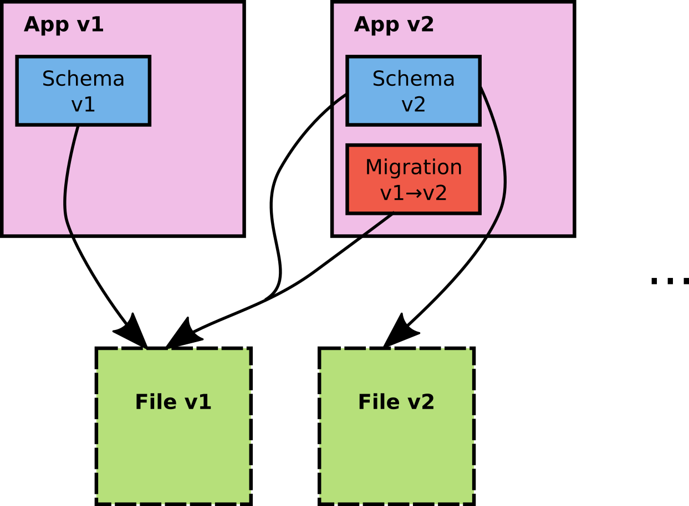
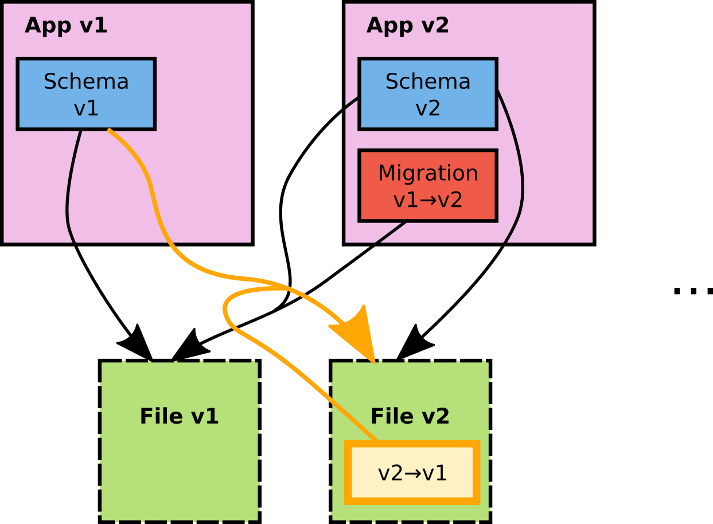

# Who's talking

Embedded Software Engineer @ {.plain width=80 height=80}

Working on Software Updates for Cars and other Linux computers


{.plain width=55 height=55} [https://github.com/lbonn](https://github.com/lbonn)

{.plain width=60 height=40} [bonnans.l@gmail.com](mailto:bonnans.l@gmail.com)

Do *not* have a blog

# SQLite

[https://www.sqlite.org/appfileformat.html](https://www.sqlite.org/appfileformat.html)

Some key benefits, almost for free:

* powerful queries
* partial reads
* atomic transactions
* concurrent access

::: notes
Compare with

* custom format (doc, pdf)
* pile-of-files (git)
* wrapped pile-of-files (odt)
:::

# OK let's go and C++

``` {.c++}
std::string getUserCountry(const std::string &user_id) {
    sqlite3* h;
    sqlite3_open("app.db", &h);
    std::stringstream st;
    st << "SELECT country FROM users WHERE user_id='" << user_id << "';";
    std::string country;
    auto callback = [](void* c, int, char **res, char**) -> int {
        auto co = static_cast<std::string*>(c);
        *co = res[0];
        return 0;
    };

    sqlite3_exec(h, st.str().c_str(),
        callback, static_cast<void*>(&country), nullptr);

    sqlite3_close(h);

    return country;
}
```

:::{.fragment}
Oh no...
:::

:::{.fragment}
... what have I done?
:::

::: notes
+2

SQL injection, lots of casts
:::

# The real API

``` {.c++}
std::string getUserCountry(const std::string &user_id) {
    sqlite3* h;
    sqlite3_open("app.db", &h);

    sqlite3_stmt* statement;
    sqlite3_prepare_v2(h, "SELECT country FROM users WHERE user_id=?;", -1,
        &statement, nullptr);
    sqlite3_bind_text(statement, 1, user_id.c_str(), -1, nullptr);

    int ret = sqlite3_step(statement);
    if (ret != SQLITE_ROW) throw std::runtime_error(sqlite3_errmsg(h));
    auto r = reinterpret_cast<const char*>(sqlite3_column_text(statement, 0));

    sqlite3_finalize(statement);
    sqlite3_close(h);

    return r;
}
```

:::{.fragment}
C and it shows:

**verbose**, **not exception safe**, **unhandled error cases**
:::

::: notes
+1
:::

# A C++ version


``` {.c++}
std::string getUserCountry(const std::string &user_id) {
    sql::Guard db("app.db");

    auto st = db.prepareStatement<std::string>(
            "SELECT country FROM users WHERE user_id=?;",
            user_id);

    int ret = st.step();
    if (ret == SQLITE_DONE) {
        throw std::runtime_error("not found");
    } else if (ret != SQLITE_ROW) {
        throw std::runtime_error(sqlite3_errmsg(h));
    }

    return st.get_result_col_str(0).value();
}
```


# Smart Statement


``` {.c++}
class Statement {
  template <typename... Types>
  Statement(sqlite3* db, const std::string& zSql, const Types&... args) {
    // ...
    bindArguments(args...);
  }

  void bindArgument(const std::string& v) {
    owned_data_.push_back(v);
    const std::string& oe = owned_data_.back();
    sqlite3_bind_text(stmt_.get(), bind_cnt_, oe.c_str(), -1, nullptr);
  }

  template <typename T, typename... Types>
  void bindArguments(const T& v, const Types&... args) {
    bindArgument(v);
    bind_cnt_ += 1;
    bindArguments(args...);
  }
}
```

# The currency converter

:::{.fragment}
A fictional answer to a totally-not saturated market

[https://github.com/lbonn/sql-file](https:///github.com/lbonn/sql-file)

{.plain width=400 height=400}

:::

# Concept

An app to convert currencies

* with historical data
* offline mode: store conversion rates in a file

:::{.fragment}
We need to be **fast on the market**:

* MVP with EUR/USD
:::

::: notes
+1
:::

# SQL Schema

v1:

```{.sql}
CREATE TABLE eurusd(spot_date TEXT PRIMARY KEY, val REAL NOT NULL);
```

:::{.fragment}
v2:

```{.sql}
CREATE TABLE convs(id INTEGER PRIMARY KEY, conv_name TEXT UNIQUE NOT NULL, conv_description TEXT NOT NULL);

CREATE TABLE spots(id INTEGER PRIMARY KEY, conv_id INTEGER, spot_date TEXT NOT NULL, val REAL NOT NULL, FOREIGN KEY(conv_id) REFERENCES convs(id) UNIQUE(conv_id, spot_date));
```
:::

::: notes
+1
:::

# Migration

Reading a v1 file from the v2 app

```{.sql}
CREATE TABLE convs(id INTEGER PRIMARY KEY, conv_name TEXT UNIQUE NOT NULL, conv_description TEXT NOT NULL);
INSERT INTO convs(conv_name, conv_description) VALUES("EURUSD", "euros / dollars");

CREATE TABLE spots(id INTEGER PRIMARY KEY, conv_id INTEGER, spot_date TEXT NOT NULL, val REAL NOT NULL, FOREIGN KEY(conv_id) REFERENCES convs(id) UNIQUE(conv_id, spot_date));

INSERT INTO spots(conv_id, spot_date, val) SELECT convs.id, eurusd.spot_date, eurusd.val FROM convs INNER JOIN eurusd ON convs.conv_name = "EURUSD";

DROP TABLE eurusd;
```

:::{.fragment}
First **future-proof addition**: versioning
```{.sql}
CREATE TABLE version(version INTEGER);
```
:::

::: notes
+1

The version field should be in the v1
:::

# Visualized

{.plain width=70% height=70%}

# Visualized++ {transition=zoom}

{.plain width=70% height=70%}

::: notes
Mention aktualizr
:::

# Backward and Forward compatibility

:::{.fragment}
* Include a version table
:::

:::{.fragment}
* Include a rollback migration table

```{.sql}
CREATE TABLE rollback_migrations(version_from INTEGER PRIMARY KEY, migration TEXT NOT NULL);
```
:::


:::{.fragment}
Both tables will be universal on all file format versions
:::

::: notes
+3

From day one
:::

# Code generation

Input

```
src/sql
├── embed_schemas.py
├── migration
│   ├── migrate.00.sql
│   └── migrate.01.sql
├── rollback
│   └── rollback.01.sql
└── schema.sql
```

Output

```{.c++}
extern const std::vector<std::string> currconv_schema_migrations;
extern const std::vector<std::string> currconv_schema_rollback_migrations;
extern const std::string currconv_current_schema;
```

# Thanks

* [https://github.com/lbonn/sql-file](https:///github.com/lbonn/sql-file)
* [https://github.com/advancedtelematic/aktualizr](https:///github.com/advancedtelematic/aktualizr)

# Bonus: Backward migration in practice

```{.c++}
void dbMigrateBackward(int version_from, int version_to) {
  SQLite3Guard db = dbConnection();
  for (int ver = version_from; ver > version_to; --ver) {
    std::string migration;
    {
      auto statement = db.prepareStatement(
              "SELECT migration FROM rollback_migrations WHERE version_from=?;",
              ver);
      if (statement.step() != SQLITE_ROW) {
        throw std::runtime_error("could not find migration")
      }
      migration = *(statement.get_result_col_str(0));
    }

    if (db.exec(migration, nullptr, nullptr) != SQLITE_OK) {
      throw std::runtime_error("migration failed");
    }
  }
}
```
